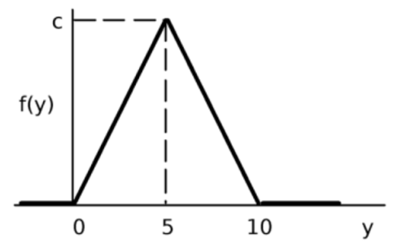
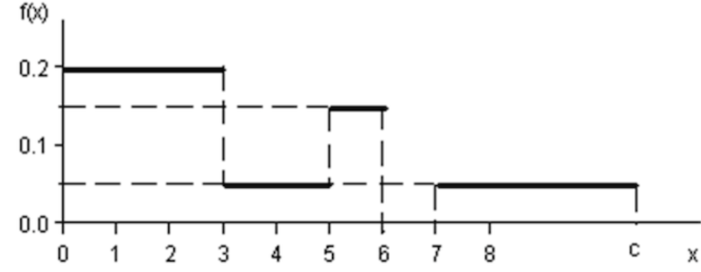
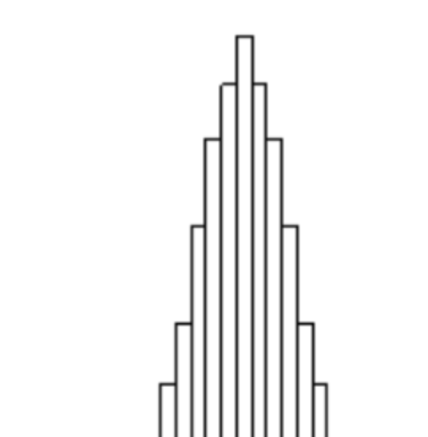
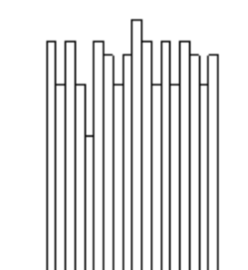
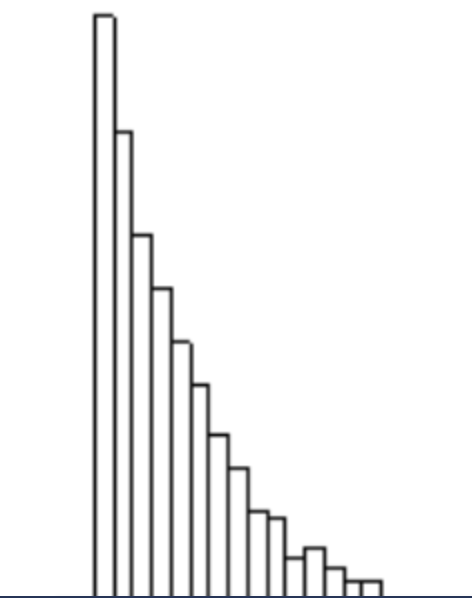
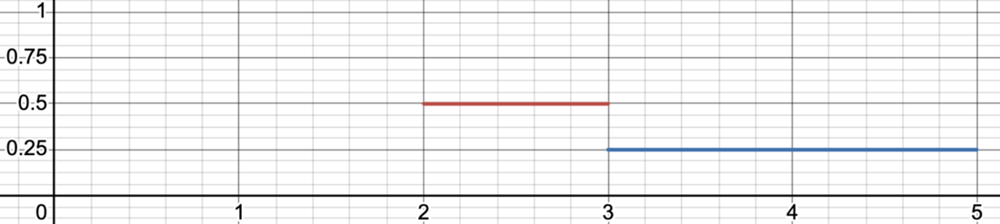
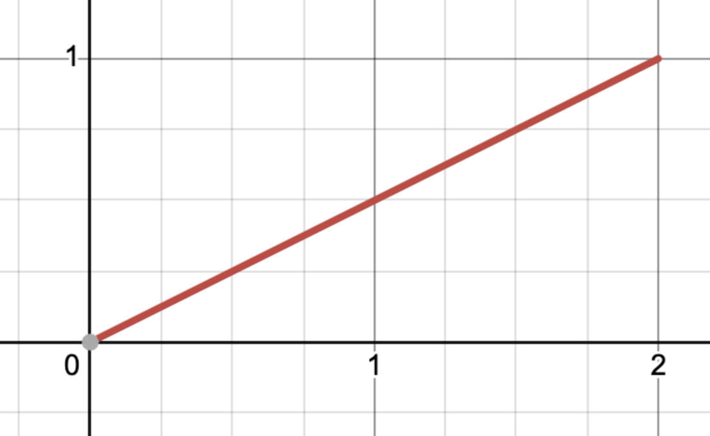
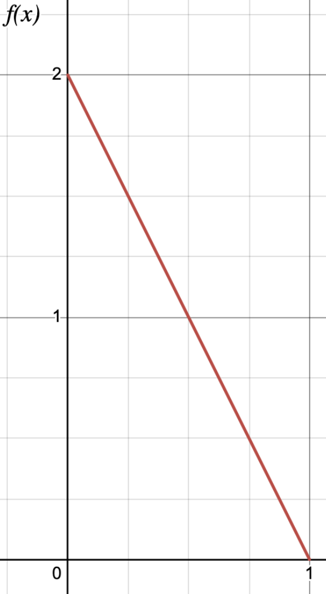
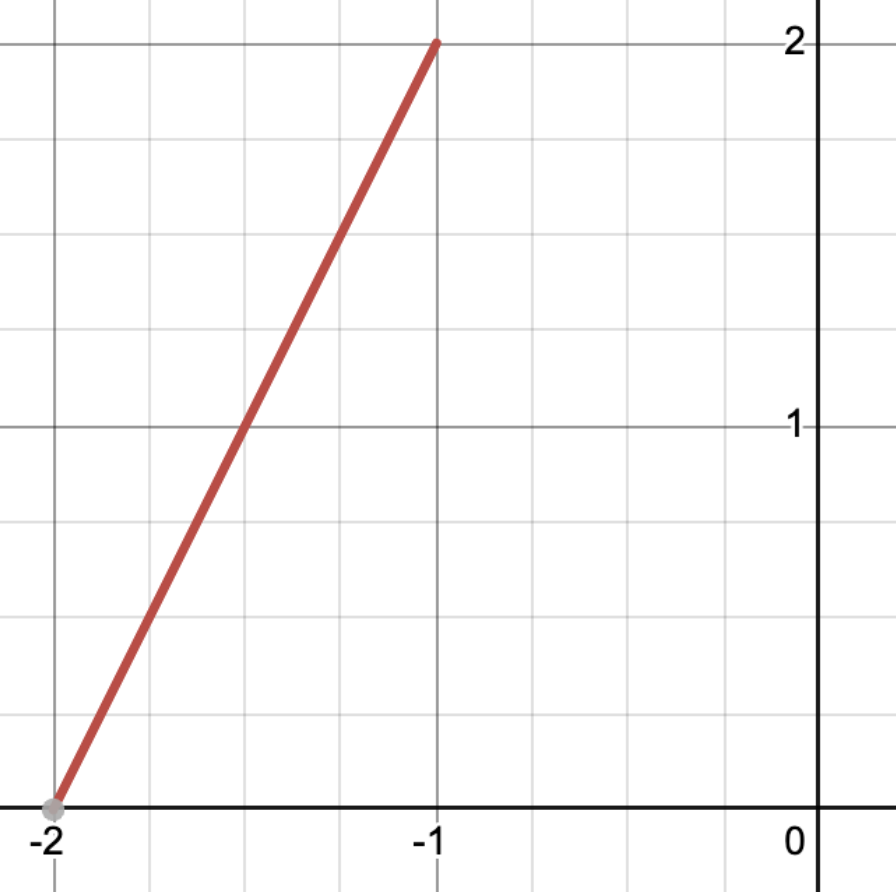
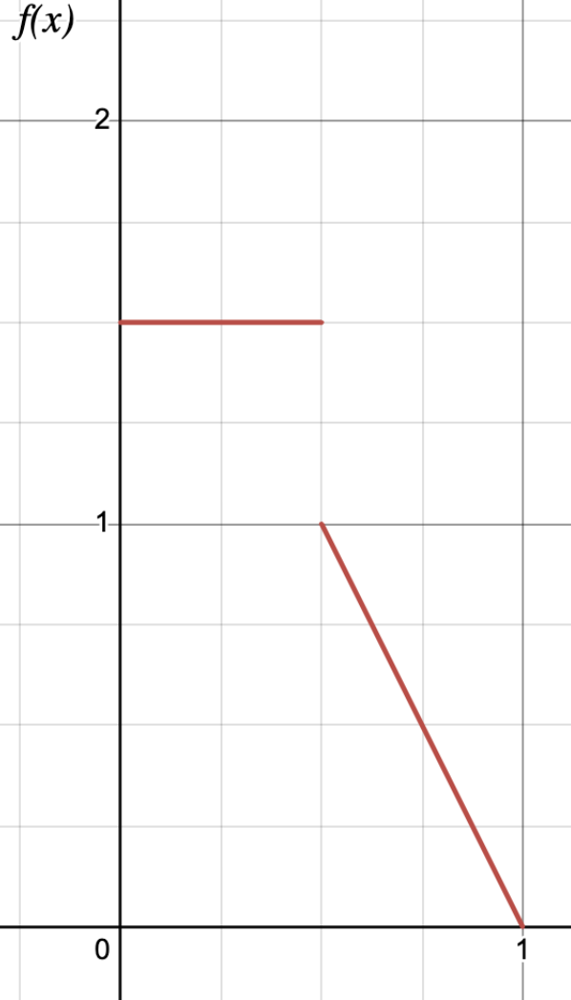

# סימולציה — תרגילי כיתה
### תשפ"ז · מחולק לפי שיעור

*סטטוס עבודה (1.9.2026): שיעורים 2–5 עברו סבב תיקונים אחד. שיעורים 6–11 הם טיוטה ראשונה שטרם נבדקה.*

**מבנה כל שיעור:** חימום (תרגילים ישירים) · שיפוט (שאלות לדיון) · אתגר (להמשך בבית)

---

## שיעור 1 — הקדמה
מצגת. אין תרגילים.

אין פזמון. תרקדו.

[מצגת ההרצאה](https://docs.google.com/presentation/d/1YKGg11YuUvN2kNIQnJt6fZyuDoxXs9jmhc-oUG4takE/edit?usp=drive_link)

---

## שיעור 2 — חזרה על הסתברות והתאמת התפלגות למודל

### חימום

**2.1** נתונה פונקציית הצפיפות שבאיור של משתנה מקרי Y.
א. מצאו את c.
ב. מצאו את פונקציית ההתפלגות המצטברת.
ג. חשבו P(Y ≤ 5), P(Y ≥ 7).

**2.2** נתונה פונקציית הצפיפות שבאיור.
א. מצאו את c.
ב. פונקציית ההתפלגות המצטברת.
ג. P(1.0 ≤ X ≤ 5.0), P(X ≥ 2.0), P(X ≥ 4).

**2.3** f(x) = x²/4 עבור 1 ≤ x ≤ 2, ו-f(x) = kx עבור 2 < x ≤ 3.
א. מצאו את k.
ב. פונקציית ההתפלגות המצטברת.
ג. P(X > 2.5).

**2.4** לכל אחת משלוש ההיסטוגרמות (איור) — איזו משפחת התפלגות סבירה? נמקו.

  

**2.5** נתונים זמני בין-הגעות (דקות): 2.1, 0.4, 5.3, 1.1, 0.9. הניחו התפלגות מעריכית וחשבו אנ"מ ל-λ.

### שיפוט

**2.6 איזו משפחה?**
לכל מצב — איזו משפחת התפלגות הייתם בוחרים (אחיד / מעריכי / נורמלי / פואסון / בינומי / אחר), ולמה? ומה הטיעון הטוב ביותר *נגד* הבחירה שלכם?
- זמן בין אוטובוסים בתחנה ללא לוח זמנים
- ציוני בחינה בקורס גדול
- מספר שגיאות כתיב בעמוד
- זמן שירות בדלפק בנק
- מספר לקוחות שנכנסים לחנות בשעה
- זמן עד תקלה בנורה

**2.7 טנקים גרמניים.**
אתם בריטים במלחמת העולם השנייה. ראיתם ארבעה טנקים גרמניים עם המספרים הסידוריים 14, 31, 55, 71. כמה טנקים יש לאויב? כתבו מספר ונימוק.

**2.8 פרדוקס ההמתנה.**
אוטובוסים מגיעים לתחנה בממוצע כל 10 דקות, לפי תהליך פואסון. אתם מגיעים לתחנה ברגע אקראי. כמה תחכו בממוצע — 5 דקות? 10? משהו אחר? נמקו.

**2.9 ציד באגים.**
סטודנטית מדדה זמני שירות בדלפק, קיבלה ממוצע 3 דקות וסטיית תקן 2 דקות, והתאימה התפלגות נורמלית N(3, 2²). הסימולציה שלה רצה. מה הבעיה, ואיך היה צריך לגלות אותה *לפני* שהריצה?

### אתגר

**2.10** נתונה משפחת הצפיפויות f_{θ}(x) = θx^{θ−1} על הקטע [0,1], עם פרמטר חיובי θ.
א. גזרו את אנ"מ ל-θ מתוך מדגם x₁,…,xₙ.
ב. (הצצה לשיעור 4) מצאו את F(x) והציעו דרך לדגום מ-X בעזרת U~U(0,1).
ג. בפייתון: קבעו θ=2, דגמו n ערכים, אמדו, וחזרו 1000 פעמים. ציירו את ההטיה הממוצעת של האומד כפונקציה של n עבור n=5,10,20,50,100. מה אתם רואים?

---

## שיעור 3 — מבחני טיב התאמה

### חימום

**3.1** נמדדו 40 ערכים וחולקו ל-5 תאים ברוחב 1 על הקטע [0,5]. השכיחויות הנצפות: 11, 6, 9, 4, 10.
הריצו מבחן χ² ברמת ביטחון 90% לבדיקת ההשערה שהנתונים מתפלגים U(0,5).

**3.2** נתונים 5 ערכים (ממוינים): 0.3, 1.6, 2.4, 3.5, 4.7.
הריצו מבחן קולמוגורוב-סמירנוב ברמת ביטחון 90% לבדיקת ההשערה שהם מתפלגים U(0,5).

### שיפוט

**3.3 טוב מדי?**
סטודנטית הביאה 20 מדידות: 0.5, 1.5, 2.5, 3.5, 4.5, 0.1, 1.1, 2.1, 3.1, 4.1, 0.9, 1.9, 2.9, 3.9, 4.9, 0.2, 1.2, 2.2, 3.2, 4.2. היא הריצה χ² מול U(0,5) עם 5 תאים וקיבלה סטטיסטי 0 בדיוק. "התאמה מושלמת!"
האם זו בשורה טובה? מה ההתפלגות של סטטיסטי χ² *כשההשערה נכונה*, ומה הסיכוי לקבל בדיוק 0?

**3.4 מלחמת התאים.**
נתונות 40 מדידות על הקטע [0,5]. שלוש סטודנטיות הריצו עליהן χ² מול U(0,5): אחת עם 2 תאים, אחת עם 5, אחת עם 10.
מי צודק? האם המסקנה יכולה להשתנות בין השלוש? מה בעצם קובע כמה תאים "מותר"?

**3.5 "המבחן עבר — המודל תקין".**
סטודנטית מדדה 3 זמני שירות, הריצה K-S מול מעריכי ברמת 90%, המבחן לא דחה, והיא כתבה בדו"ח: "ההתפלגות המעריכית אומתה סטטיסטית."
האם המשפט נכון? מה מבחן טיב התאמה *כן* אומר כשהוא לא דוחה, ומה הוא *לא* אומר?

**3.6 χ² נגד K-S.**
לכל מצב — איזה מבחן מתאים יותר, ולמה?
- מספר לקוחות ביום, נתונים בדידים 0–12
- 15 זמני שירות רציפים
- 50,000 זמני בין-הגעות מקובץ לוג של שרת
- זמני שירות רציפים, כאשר את λ אמדתם *מאותם נתונים*

**3.7 ציד באגים.**
סטודנטית רצתה לבדוק אם זמני השירות שמדדה מתפלגים מעריכית. היא אמדה את λ מהנתונים, חילקה את הנתונים ל-6 תאים, חישבה את סטטיסטי χ², השוותה לערך הקריטי עם 5 דרגות חופש, והסיקה שההשערה לא נדחית.
בנוסף, חברתה הריצה K-S על 50,000 תצפיות אמיתיות, המבחן דחה כל התפלגות שניסתה, והיא כתבה: "לא קיימת התפלגות מתאימה, אי אפשר לבנות סימולציה."
מצאו את הטעות של כל אחת מהן.

### אתגר

**3.8** הניסוי: דוגמים n ערכים מ-Exp(1), אומדים λ מהנתונים, ומריצים χ² ו-K-S ברמת α=0.1 מול Exp(λ̂). חוזרים 1000 פעמים ורושמים את שיעור הדחיות. וכך עבור n = 10, 30, 100, 300, 1000.
א. לפני שכותבים שורת קוד: מה לדעתכם יצא? איזה שיעור דחיות "אמור" להתקבל אם המבחן תקין, והאם הוא ישתנה עם n? שרטטו ניחוש של הגרף.
ב. עכשיו כתבו את זה בפייתון וציירו את הגרף האמיתי. איפה הניחוש צדק ואיפה לא, ובאיזה מבחן?
ג. הסבירו את הפער. (רמז: מה קורה לערכים הקריטיים של K-S כשהפרמטר נאמד מאותו מדגם?)

---

## שיעור 4 — אלגוריתמי דגימה א

### חימום

**4.1** X בדיד עם P(3)=½, P(5)=P(6)=¼. כתבו אלגוריתם דגימה ל-X.

**4.2** X רציף עם פונקציית הצפיפות שבאיור. כתבו אלגוריתם דגימה בשיטת הטרנספורם ההופכי.

**4.3** X רציף עם f(x)=x/2 עבור 0 ≤ x ≤ 2. כתבו אלגוריתם דגימה.

**4.4** X רציף עם f(x)=2−2x עבור 0 ≤ x ≤ 1. כתבו אלגוריתם דגימה בשיטת הטרנספורם ההופכי.

**4.5** X רציף עם f(x)=2(x+2) עבור −2 ≤ x ≤ −1. כתבו אלגוריתם דגימה.

**4.6** X ~ U(0,2). Y בדיד עם P(1)=P(10)=¼, P(2)=½. כתבו אלגוריתם דגימה ל-Y שמשתמש *רק* באלגוריתם דגימה ל-X.

**4.7** Y בדיד עם P(1)=P(10)=¼, P(2)=½. Z בדיד עם P(10)=P(21)=½. כתבו אלגוריתם דגימה ל-Z שמשתמש *רק* באלגוריתם דגימה ל-Y.

### שיפוט

**4.8 לה ביסקוט** (שאלה ממבחן).
קונדיטוריית "לה ביסקוט" מייצרת קינוחים בשני מטבחים: 60% במטבח הלונדוני, 40% בפריזאי. במטבח הלונדוני זמן ההכנה מתפלג U(20,40) דקות. במטבח הפריזאי זמן ההכנה מתפלג לפי הצפיפות f(t) = t/50 עבור 0 ≤ t ≤ 10.

א. פתחו אלגוריתם דגימה לזמן ההכנה של קינוח, ללא קבלה-דחייה.
ב. סטודנטית א' משתמשת בשני מספרים אקראיים לכל דגימה. סטודנטית ב' טוענת שמספיק אחד: "אם u<0.6, אז u/0.6 הוא בעצמו אחיד על (0,1) — נשתמש בו שוב." מי צודק?
ג. מתי מותר "למחזר" מספר אקראי, ומתי זה מקלקל את הדגימה?

**4.9 הטרנספורם ההופכי תמיד מנצח?**
לכל מקרה — איזו שיטה עדיפה, טרנספורם הופכי או קומפוזיציה, ולמה?
א. f(x) = 2−2x על [0,1].
ב. f(x) = x⁴/8 + x³/4 + x²/2 + 179/240 עבור 0 ≤ x ≤ 1.
ג. משתנה בדיד עם מיליון ערכים אפשריים.
ד. משתנה בדיד עם שני ערכים.

**4.10 האם האלגוריתם נכון?**
*מטרה:* X בדיד עם P(3)=½, P(5)=P(6)=¼.
*האלגוריתם:* דגום u. אם u<0.5 החזר 3. אחרת: דגום v; אם v<0.5 החזר 5, אחרת החזר 6.
האם האלגוריתם דוגם נכון מההתפלגות המבוקשת? אם לא — מאיזו התפלגות הוא דוגם בפועל?

**4.11 שני אחידים.**
לכל אלגוריתם — האם הוא דוגם נכון מההתפלגות המבוקשת? אם לא — מאיזו התפלגות הוא דוגם בפועל?
א. *מטרה:* U(1,3). דגום u₁, u₂. החזר 1 + 2·max(u₁, u₂).
ב. *מטרה:* U(0,1). דגום u₁, u₂. החזר (u₁+u₂)/2.

**4.12 מינוס שורש.**
*מטרה:* f(x)=2−2x על [0,1].
*האלגוריתם:* דגום u. החזר 1 − √u.
האם האלגוריתם דוגם נכון מההתפלגות המבוקשת? אם לא — מאיזו התפלגות הוא דוגם בפועל?

**4.13 מקוביה מוטה לכל דבר.**
בידיכם רק אלגוריתם דגימה ל-Y בדיד עם P(1)=P(10)=¼, P(2)=½ (שלושה ערכים, לא סימטרי). טענה: "אפשר לייצר ממנו U(0,1) מדויק, ולכן כל התפלגות שהיא." האם הטענה נכונה? אם כן — איך? אם לא — מה חסר?

### אתגר

**4.14** עבור הצפיפות f(x) = x⁴/8 + x³/4 + x²/2 + 179/240 על [0,1]:
א. כתבו אלגוריתם דגימה בשיטת הקומפוזיציה. כמה מספרים אקראיים הוא צורך בממוצע לדגימה?
ב. כתבו אלגוריתם בטרנספורם הופכי (F(x) פולינום ממעלה 5 — פתרו נומרית).
ג. בפייתון: ממשו את שניהם, דגמו 100,000 פעמים מכל אחד, השוו היסטוגרמות לצפיפות, ומדדו זמן ריצה. מי ניצח, ולמה?

---

## שיעור 5 — אלגוריתמי דגימה ב

### חימום

**5.1** בכד 5 כדורים ממוספרים 1–5. בשלב הראשון נבחר כדור באקראי. אם מספרו זוגי — זהו המספר הסופי. אם אי-זוגי — מוציאים כדור נוסף, ומספרו הוא המספר הסופי. כתבו אלגוריתם דגימה שמדמה את התהליך.

**5.2** X עם צפיפות f(x) = 1.5x² + x עבור 0 < x < 1. כתבו אלגוריתם דגימה בשיטת הקומפוזיציה.

**5.3** בחנות 70% תפוחים ו-30% תפוזים. משקל תפוח ~ U(3,5), משקל תפוז ~ U(4,8). כתבו אלגוריתם דגימה למשקל של פרי אקראי:
א. בשיטת קבלה-דחייה. מה שיעור הקבלה?
ב. בשיטת הקומפוזיציה.

**5.4** X רציף עם פונקציית הצפיפות שבאיור. כתבו אלגוריתם דגימה.

**5.5** הריצו 3 צעדים של LCG(a=3, c=0, m=32, z₀=1).

**5.6** מה אורך המחזור של LCG(a=1, c=512, m=1024, z₀=1)?

### שיפוט

**5.7 מי מהיר יותר?**
עבור f(x)=2−2x על [0,1] יש לנו שני אלגוריתמים: טרנספורם הופכי (x = 1−√u) וקבלה-דחייה עם פונקציה חוסמת קבועה 2.
א. כמה מספרים אקראיים צורך כל אחד בממוצע?
ב. על מחשב אמיתי — מי לדעתכם מהיר יותר, ולמה?
ג. האם יש פונקציה חוסמת טובה יותר מקבוע 2? מה זה בכלל אומר "פונקציה חוסמת טובה"?

**5.8 האם כל צפיפות ניתנת לדגימה בקבלה-דחייה?**
לכל מקרה: האם קבלה-דחייה עובדת? האם טרנספורם הופכי עובד? מה אפשר ומה אי אפשר?
א. Exp(1) על [0,∞). מהי הפונקציה החוסמת?
ב. f(x) = 1/(2√x) על (0,1).
ג. f(x) ∝ exp(−x⁴) על ℝ — הקבוע המנרמל לא ידוע לכם.

**5.9 מחזור מלא = מחולל טוב?**
א. LCG(a=4, c=1, m=9, z₀=1). מה אורך המחזור?
ב. LCG(a=1, c=1, m=16, z₀=0). מה אורך המחזור?
ג. שני המחוללים הגיעו לאורך מחזור מקסימלי. האם שניהם טובים באותה מידה לסימולציה? מה עוד נדרש ממחולל, מעבר לאורך מחזור?

**5.10 מלחמת הסידים.**
משווים שתי חלופות של מערכת. סטודנטית א' הריצה את שתיהן עם seed=42. סטודנטית ב': "טעות — צריך סידים שונים, אחרת ההרצות תלויות." סטודנטית ג': "להפך — אותו סיד זה בדיוק מה שצריך." מי צודק, ולמה?

**5.11 אקראיות אמיתית.**
המחולל שלכם עובר כל מבחן סטטיסטי שניסיתם. מציעים לכם במקומו רכיב חומרה שמייצר אקראיות אמיתית מרעש תרמי. מה תעדיפו לסימולציה, ולמה?

### אתגר

**5.12** בפייתון:
א. ממשו קבלה-דחייה למשקל של פרי אקראי — 70% תפוחים במשקל U(3,5) ו-30% תפוזים במשקל U(4,8) — עם פונקציה חוסמת קבועה. מדדו את שיעור הקבלה האמפירי והשוו לחישוב.
ב. תכננו פונקציה חוסמת מדרגתית (לא קבועה) והראו כמה שיעור הקבלה משתפר.
ג. ממשו LCG(a=3, c=0, m=32) וציירו את כל הזוגות (zᵢ, zᵢ₊₁) במישור. חזרו עם numpy.random. מה ההבדל, ולמה זה משנה?

---

## שיעור 6 — תכנות אירועים
מצגת. אין תרגילים.

אין פזמון. תרקדו.

[מצגת ההרצאה](https://docs.google.com/presentation/d/1vssIUFy1TPZ2x_URWY4JT9OrC3tbJCBspfEFUxYqROA/edit?usp=drive_link)

---

## שיעור 7 — תכנות אירועים ב

**הסיפור — בית קפה:**
- לקוחות נכנסים כל 2–5 דקות, בהתפלגות אחידה.
- לקוחה מזמינה אספרסו (70%) או קפוצ'ינו (30%). אספרסו לוקח 2 דקות להכין, קפוצ'ינו 3.
- שתי בריסטות, כל אחת עם תור משלה; מכינות לפי סדר ההגעה. לקוחה מצטרפת לתור הקצר יותר ברגע שהיא מגיעה.
- הסימולציה נגמרת כששורתו 1000 לקוחות.
- המדד: זמן ההמתנה הממוצע לקפה (מהכניסה עד קבלת המשקה, כולל זמן ההכנה).

---

## שיעור 8 — תכנון וניתוח

### חימום

**8.1** תוצאות 5 הרצות למספר הלקוחות המרוצים: 4, 7, 2, 3, 10. חשבו רווח סמך ברמת ביטחון 90%.

**8.2** שלוש חזרות של מערכת לא מסתיימת, זמן המתנה ממוצע בכל שעה מ-6 השעות הראשונות:
- חזרה 1: 10, 7, 6, 5, 5, 5
- חזרה 2: 12, 8, 6, 6, 5, 6
- חזרה 3: 11, 9, 7, 5, 6, 5
הריצו את שיטת ולש עם חלון 1 ועם חלון 2. מתי מסתיים החימום?

**8.3** מתוך 200 לקוחות, 30 חיכו יותר מ-5 דקות. חשבו רווח סמך ברמת 90% לפרופורציית הלקוחות שמחכים יותר מ-5 דקות.

### שיפוט

**8.4 מסתיים או לא?**
לכל מערכת — מסתיים או לא מסתיים? ומה זה משנה בתכנון הניסוי?
- בנק שפתוח 9–17
- חדר מיון
- פס ייצור בשלוש משמרות
- מוקד טלפוני שנסגר בלילה אבל התור נשמר למחר
- סימולציה של בחירות

**8.5 מיליון תצפיות.**
"הרצתי הרצה אחת ארוכה של מיליון לקוחות. יש לי מיליון תצפיות של זמן המתנה, אז רווח הסמך שלי זעיר." האם רווח הסמך תקין? מה הייתם עושים במקום?

**8.6 למה לזרוק נתונים?**
"ולש אומר לי למחוק את השעה הראשונה. אבל יותר נתונים זה תמיד יותר טוב — למה לזרוק?" מה התשובה?

**8.7 מה אומר רווח סמך?**
"רווח סמך 90% הוא [4.5, 6.1], ולכן התוחלת האמיתית נמצאת שם בהסתברות 90%." נכון או לא? אם לא — מה כן נכון?

### אתגר

**8.8** בפייתון: תור עם שרת אחד, הגעות מעריכיות בקצב 0.9 ושירות מעריכי בקצב 1. הריצו הרצה ארוכה אחת וחשבו רווח סמך לזמן ההמתנה הממוצע בשלוש דרכים: (א) כאילו התצפיות בלתי תלויות, (ב) ממוצעי אצוות, (ג) 30 חזרות בלתי תלויות. חזרו על הניסוי 200 פעמים ובדקו כמה פעמים כל רווח סמך באמת מכיל את הערך התאורטי (9). מה אתם רואים?

---

## שיעור 9 — תכנון וניתוח ב

### חימום

**9.1** שלושה מדדים, 2 חלופות, רווחי סמך להכל, והכל ברמת ביטחון כוללת של 90%. איזו רמת ביטחון לכל רווח סמך?

**9.2** מה הדיוק המוחלט והיחסי של רווח סמך מ-9 עד 11? ושל רווח סמך מ-99 עד 101?

**9.3** נתון רווח סמך 30 ± 8 שנעשה עבור 100 הרצות. כמה הרצות נוספות צריך כדי להגיע ל-± 1?

**9.4** נתון רווח סמך 10 ± 1 שנעשה עבור 1000 הרצות. כמה הרצות נוספות צריך כדי להגיע לדיוק יחסי של אחוז אחד?

### שיפוט

**9.5 בונפרוני שמרן מדי.**
"במקום 98.3% לכל רווח סמך, אדווח כל אחד ב-90% ואגיד שהכל 'בערך 90%'." מה בעצם רמת הביטחון הכוללת במקרה הזה, במקרה הגרוע? האם יש מצב שבו זה בכל זאת סביר?

**9.6 דיוק יחסי ליד אפס.**
הלקוחה דורשת דיוק יחסי של 1% על המדד "רווח חודשי". הרווח הצפוי הוא בערך 0. מה הבעיה, ומה תציעו במקום?

**9.7 6400 הרצות, שעה כל אחת.**
הנוסחה אומרת שצריך 6400 הרצות. כל הרצה לוקחת שעה. מה האפשרויות שלכם?

**9.8 להציץ.**
"אריץ 20 הרצות, אבדוק אם הרווח צר מספיק, ואם לא — אוסיף 10 ואבדוק שוב, וכן הלאה עד שזה יוצא." האם רמת הביטחון בסוף באמת 90%? למה כן או למה לא?

### אתגר

**9.9** בפייתון: ממשו את הנוהל מ-9.8 ובדקו אמפירית, על 1000 ניסויים, באיזה שיעור מהם רווח הסמך הסופי מכיל את התוחלת האמיתית. השוו לנוהל דו-שלבי (הרצות ראשוניות → חישוב n → הרצות נוספות ללא הצצה). מה ההבדל?

---

## שיעור 10 — השוואה בין שתי חלופות

### חימום

**10.1** לכל מצב — טי מזווג או ולש?
א. הרצתי אצלי במעבדה חלופה אחת, והשותפה האיראנית הריצה אצלה חלופה שנייה.
ב. כמות מכירות קומיקס בשני סניפים של חנות אנימה.
ג. שתי החלופות, אותם סידים, אצלי.
ד. חלופה א' — 10 הרצות, חלופה ב' — 20 הרצות.

**10.2** טי מזווג ברמת 90%:
- חלופה א': 12, 15, 11, 14, 13
- חלופה ב': 10, 14, 9, 13, 12
(שתיהן עם אותם סידים, לפי הסדר.)

**10.3** ולש ברמת 90%:
- חלופה א': 12, 15, 11, 14, 13
- חלופה ב': 10, 14, 9, 13, 12, 11

### שיפוט

**10.4 אותם סידים.**
למה אותם סידים בשתי החלופות עוזרים? האם יש מצב שבו אותם סידים דווקא *לא* עוזרים, או אפילו מזיקים? (רמז: מה קורה אם בחלופה ב' יש בריסטה שלישית?)

**10.5 "החלופות שוות".**
רווח הסמך להפרש הוא [−0.3, 2.1]. הוא מכיל את 0, ולכן החלופות שוות. נכון?

**10.6 מובהק אבל חסר משמעות.**
ההפרש בין החלופות הוא 0.01 דקות, ורווח הסמך הוא ± 0.005. מה אתם אומרים ללקוחה?

**10.7 מזווג בכוח.**
"טי מזווג חזק יותר, אז אעשה אותו גם על הנתונים מהשותף האיראני — פשוט אזווג לפי הסדר." מה משתבש?

### אתגר

**10.8** בפייתון: על בית הקפה מ-7.7, השוו את שתי ההצעות (בריסטה שלישית / מכונה מהירה) פעם עם סידים משותפים ופעם עם סידים בלתי תלויים, 30 חזרות בכל פעם. השוו את רוחב רווח הסמך להפרש. בכמה הצטמצם?

---

## שיעור 11 — השוואה בין יותר משתי חלופות

### חימום

**11.1** יש 7 חלופות, רוצים להשוות את כולן לכולן, כולן עם אותם סידים, רמת ביטחון כוללת 90%. כמה השוואות? איזה מבחן? איזו רמת ביטחון לכל השוואה?

**11.2** 5 חלופות חדשות מול תצורה קיימת (סטנדרט), רמת ביטחון כוללת 95%. כמה השוואות, ואיזו רמת ביטחון לכל אחת?

**11.3** רווחי סמך להפרש "חלופה פחות סטנדרט" (חיובי = טוב יותר):
- A: 1.2 ± 0.8
- B: 0.3 ± 0.5
- C: −0.9 ± 0.4
- D: 2.0 ± 2.5
אילו חלופות טובות מהסטנדרט? אילו גרועות? ומה עם השאר?

### שיפוט

**11.4 מה הלקוחה באמת רוצה?**
ללקוחה 7 תכנונים והיא רוצה "את הטוב ביותר". אפשר: כולם מול כולם, כולם מול הקיים, או נוהל בחירת הטובה ביותר. מה תבחרו, ומה מבזבז כוח סטטיסטי בשתי האפשרויות האחרות?

**11.5 קודם לסנן, אחר כך לאשר.**
"21 השוואות עם בונפרוני זה 99.5% לכל אחת — בלתי אפשרי. אז קודם אעשה את כולן ב-90% כל אחת, ורק את ה'מעניינות' אאשר ברמה גבוהה." האם זה לגיטימי? מה הבעיה?

**11.6 שוות אבל אחת זולה.**
שתי חלופות שרווח הסמך להפרש ביניהן מכיל 0, ואחת מהן זולה בהרבה ליישום. מה ההמלצה, ואיך מנסחים אותה בזהירות?

**11.7 הממוצע הכי גבוה.**
"לחלופה D יש את הממוצע המדגמי הכי גבוה, אז היא הטובה ביותר." מה חסר במשפט הזה?

### אתגר

**11.8** בפייתון: 5 חלופות עם תוחלות אמיתיות 10, 10, 10, 10.5, 11 (רעש נורמלי, ס"ת 2). עבור n = 10, 30, 100 הרצות לחלופה: הריצו בונפרוני כולם-מול-כולם ברמה כוללת 90%, וחזרו 500 פעמים. באיזה שיעור מהניסויים החלופה הטובה באמת מזוהה כטובה ביותר באופן מובהק? השוו לנוהל שמשווה רק מול החלופה עם הממוצע המדגמי הגבוה ביותר.

---

## שיעור 12 — חזרה והעשרה
[מצגת הסיכום](https://docs.google.com/presentation/d/1LW4a90O1JJy65eLVlJXGNMMcWD-iTaltFXH9f34_gbY/edit?usp=drive_link)

---

## שיעור 13 — שאלות פתוחות
*(שאלות חופשיות בכיתה)*
